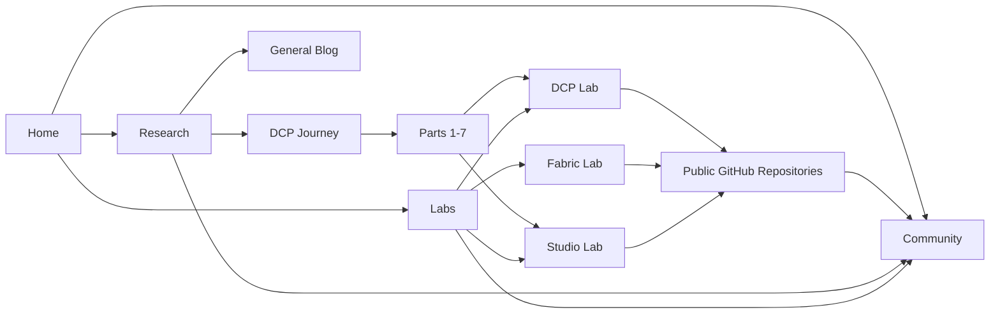

# Unfurl Systems Website Sitemap and Designer Brief

> **Status:** First draft  
> **Purpose:** A research-first website connecting ideas, working labs, public repositories, and community participation.

## Core Visitor Journey

**Understand the vision -> explore the research -> inspect a lab -> open the public repository -> participate in the discussion.**

## Design Tone

Open, ambitious, technically credible, and honest about research status. Avoid product-marketing language that suggests production maturity where it does not yet exist.

---

## 1. Website Purpose

The Unfurl Systems website should explain an emerging research direction without pretending the work is already a finished product suite. It should make the thinking approachable, make the technical work inspectable, and make it easy for interested readers to contribute ideas or code.

### Research explains why

The blog and DCP Journey introduce the problems, concepts, and design philosophy in language that a broad technical audience can follow.

### Labs explains what exists

Each Lab page gives a concise technical introduction, current status, specification links, related research, and a path to the public repository.

### GitHub shows the work

Repositories expose specifications, examples, source code, issues, and contribution guidance. The website should summarize rather than duplicate the repository.

### Community closes the loop

Readers should be able to move from understanding the idea to questioning it, proposing an example, reporting a gap, or contributing an implementation.

---

## 2. Sitemap Overview

```text
/
├── /research
│   ├── /research/dcp
│   │   ├── /research/dcp/part-1-missing-harness
│   │   ├── /research/dcp/part-2-baseline-shift
│   │   ├── /research/dcp/part-3-capability-contract
│   │   ├── /research/dcp/part-4-draft-spec
│   │   ├── /research/dcp/part-5-human-harness
│   │   ├── /research/dcp/part-6-aggregation
│   │   └── /research/dcp/part-7-living-assembly
│   └── /research/blog
├── /labs
│   ├── /labs/dcp
│   ├── /labs/fabric
│   └── /labs/studio
├── /community
└── /about
```

### Relationship Map



---

## 3. Primary Navigation

| Route | Navigation Label | Purpose | Primary Next Step |
|---|---|---|---|
| `/` | Home | Introduce the Unfurl Systems thesis and provide clear entry points into Research, Labs, and Community. | Explore the DCP Journey or view Labs |
| `/research` | Research | Publishing hub with two tracks: the seven-part DCP Journey and the general engineering/research blog. | Choose a research track |
| `/labs` | Labs | Index of active research implementations and specifications. | Open a Lab page |
| `/community` | Community | Contribution paths, discussions, roadmap, and contact. | Join or contribute |
| `/about` | About | Mission, research posture, principles, and team or maintainer information. | Understand the project |

### Naming Note

Use **Research** as the visible navigation label because it can contain both the structured DCP series and independent essays. A simple `/blog` route may redirect to `/research` for visitors who naturally type or search for "blog."

---

## 4. Homepage

### Hero

**Suggested headline:**

> Building the human and AI harness for intelligent systems.

Supporting copy should explain that Unfurl Systems is exploring how components describe themselves, compose safely, and remain understandable to humans.

**Primary calls to action:**

- Explore Research
- View Labs

### Three Pillars

Create three cards:

1. **Research** - The ideas, problems, and design philosophy behind the work.
2. **Labs** - Current specifications, prototypes, and technical implementations.
3. **Community** - Open questions, discussions, examples, and contribution paths.

### Current Research

Feature the **DCP Journey** as the primary editorial path. Show progress through Parts 1-7 and highlight the latest article.

### Featured Labs

Cards for:

- DCP
- Unfurl Fabric
- Unfurl Studio

Each card should show:

- One-line purpose
- Maturity or status label
- Link to the Lab page

### Open Invitation

Use a restrained contribution block:

> This work is evolving. Challenge the model, bring a domain example, or help implement it.

### Footer

Include:

- Research
- Labs
- GitHub organization
- Contribution guide
- Contact
- Legal and privacy links as needed

---

## 5. Research Information Architecture

### Research Index

| Route | Page | Purpose | Primary Next Step |
|---|---|---|---|
| `/research` | Research Index | Introduce the two editorial tracks and feature recent content. | Choose DCP Journey or General Blog |
| `/research/dcp` | DCP Journey | Series landing page with the seven-part sequence, summaries, reading order, and relevant Lab links. | Open a part or the DCP Lab |
| `/research/blog` | General Blog | Independent research notes, architecture essays, experiments, and project updates. | Open a post |

### DCP Journey

| Route | Article | Purpose | Primary Next Step |
|---|---|---|---|
| `/research/dcp/part-1-missing-harness` | Part 1: The Missing Harness | Problem framing for an AI-native interconnected world. | Continue to Part 2 |
| `/research/dcp/part-2-baseline-shift` | Part 2: The Baseline Shift | How software work moves from component construction toward governed assembly. | Continue to Part 3 |
| `/research/dcp/part-3-capability-contract` | Part 3: The Capability Contract | Public introduction to DCP claims, negotiation, contracts, and invocation. | Explore `/labs/dcp` |
| `/research/dcp/part-4-draft-spec` | Part 4: Draft Spec and Discussion | Present the current draft before inviting structured discussion. | Read the spec or comment |
| `/research/dcp/part-5-human-harness` | Part 5: The Human Harness | Introduce Unfurl Studio and the human review and governance layer. | Explore `/labs/studio` |
| `/research/dcp/part-6-aggregation` | Part 6: Aggregation Is Abstraction | Explain semantic zoom and aggregate capabilities from component to city. | Explore related projection work |
| `/research/dcp/part-7-living-assembly` | Part 7: The Living Assembly | Observe, test, trace, audit, and evolve assemblies at runtime. | Explore Studio and Fabric Labs |

### Article Template

Every research article should support:

- Series breadcrumb and part number
- Title, subtitle, author, date, and reading time
- Article body with diagrams where useful
- Previous and next article navigation
- Related Lab block
- Discussion or contribution prompt
- Optional specification and repository links

### Research Cross-Link Rule

Research pages explain ideas. Lab pages explain the current technical shape. Repository links expose the implementation.

Every substantial DCP article should link to the most relevant Lab rather than sending readers directly into raw source code without context.

---

## 6. Labs Information Architecture

### Labs Index

| Route | Lab | Purpose | Primary Next Step |
|---|---|---|---|
| `/labs` | Labs Index | Introduce active research systems and show status, purpose, and related concepts. | Open a Lab |
| `/labs/dcp` | Domain Claim Protocol | Explain what DCP is, the current draft specification, key concepts, schema overview, examples, status, related DCP Journey articles, and repository link. | Read the spec or open the repository |
| `/labs/fabric` | Unfurl Fabric | Explain the design-time compiler and composition authority: catalog, needs, matching, validation, contracts, signing, and deployment planning. | Explore architecture or repository |
| `/labs/studio` | Unfurl Studio | Explain the human harness for visually inspecting and governing DCP and Fabric assemblies. | View screenshots, specification, or repository |

### Public Lab Boundary

Do not expose Unfurl Flow or Unfurl Foundry as public Labs in the first website release. They may exist as internal implementation dependencies, runtime engines, or future research topics, but the public site should promote only the repositories needed by the DCP blog journey and its immediate Lab context.

### Standard Lab Page Template

#### 1. Status Strip

Use one or more of:

- Research
- Draft specification
- Prototype
- Active development

Include a **last updated** date.

#### 2. One-Sentence Definition

A plain-language statement of what the Lab is and why it exists.

#### 3. Problem

The specific gap the Lab addresses.

#### 4. How It Works

A short architecture explanation, preferably with one diagram.

#### 5. Current Scope

Clearly distinguish what is:

- Implemented
- Specified
- Experimental
- Deferred

#### 6. Key Concepts or Specification

Readable summaries with links to deeper specification sections.

#### 7. Examples

One or two concrete use cases.

#### 8. Related Research

Links back to relevant DCP Journey articles and general posts.

#### 9. Repository

A prominent link to the corresponding public GitHub repository.

#### 10. Participate

Link to issues, discussions, the contribution guide, or a structured request for domain examples.

---

## 7. Website-to-Repository Mapping

### Public Organization

**Organization:** `UnfurlSystemsLab`

Use this organization as the curated public surface for the repositories needed by the blog series. Do not mirror every internal implementation repository by default. Promote only repositories that have enough public context, status labeling, README guidance, and contribution posture to support the research-first website.

| Website Lab | Proposed Repository | README Should Lead With |
|---|---|---|
| `/labs/dcp` | `dcp` | Protocol purpose, specification status, draft schema narrative, examples, and discussion links |
| `/labs/dcp` | `unfurl-dcp` | Java implementation role, library usage, validation/codecs, adapter guidance, and relationship to the `dcp` spec repo |
| `/labs/fabric` | `unfurl-fabric` | Compiler role, architecture, local run, and contract workflow |
| `/labs/studio` | `unfurl-ui` | Human harness, screenshots, local setup, and relationship to Fabric and DCP |

### Repository Standards

Repositories should use consistent:

- README structure
- Status badges
- Licensing
- Contribution guidance
- Issue templates
- Links back to the matching Lab page

Flow and Foundry repositories should remain outside the promoted public repository set for now unless a later publishing decision explicitly adds them to the website and the `UnfurlSystemsLab` public surface.

---

## 8. Community

### Route

`/community`

### Suggested Content

- How to contribute
- GitHub Discussions or equivalent discussion space
- Open questions and research prompts
- Roadmap and current priorities
- Contribution guidelines
- Code of conduct
- Contact or collaboration request

Every major Research and Lab page should provide a visible path to Community.

---

## 9. About

### Route

`/about`

### Suggested Content

Explain:

- The Unfurl Systems mission
- The research-first posture
- Principles behind the work
- People or maintainers involved
- How specifications and prototypes may evolve

The page should clearly state that published specifications and prototypes are not necessarily production-ready.

---

## 10. Cross-Linking Model

| From | To | Visitor Intent |
|---|---|---|
| Homepage | Research | Understand the vision and reasoning first |
| Homepage | Labs | Inspect current technical work |
| DCP Article | DCP Lab | Move from conceptual explanation to the current specification and examples |
| Human Harness Article | Studio Lab | Move from the human-harness thesis to visual-composition work |
| Aggregation Article | Relevant Lab or Projection Work | Inspect recursive projection and aggregation implementation |
| Living Assembly Article | Studio or Fabric Lab | Inspect runtime observation and operational concepts |
| Lab | Related Research | Restore context for visitors entering from search or GitHub |
| Lab | GitHub | Move from summary and status to source, specifications, issues, and contribution |
| GitHub README | Lab | Provide a readable project overview outside the repository |
| Any Major Page | Community | Question, discuss, propose an example, or contribute |

---

## 11. First-Draft Build Scope

### Phase 1 - Publish the Core Story

Build:

- Home
- Research index
- DCP Journey index
- Seven DCP article pages
- Labs index
- DCP Lab
- About
- Shared navigation and footer

### Phase 2 - Connect Ideas to Implementations

Add:

- Fabric Lab
- Studio Lab
- Related Research blocks
- Repository links
- Reusable article and Lab templates

### Phase 3 - Open Participation

Add:

- Community hub
- Discussions
- Roadmap
- Contribution prompts
- Issue templates
- Clearer status automation from repositories

### Phase 4 - Improve Discovery

Add:

- Search
- Tags
- RSS
- Structured metadata
- Redirects
- Social preview images
- Lab status and version history

---

## 12. Designer Notes

- Use a restrained research-lab aesthetic rather than a conventional SaaS landing page.
- Make status visible. Draft, research, prototype, and active development should never be visually confused with production-ready.
- Use diagrams to explain relationships, but always provide readable text and accessible alternatives.
- Treat the DCP Journey as a connected narrative, not seven unrelated cards.
- Keep GitHub links prominent on Lab pages but secondary on conceptual Research pages.
- Design reusable cards for Research posts and Labs so the site can expand without restructuring.
- Support responsive layouts and keyboard-accessible navigation from the first draft.
- Use consistent status language across the website and repositories.

---

## 13. First-Draft Success Test

A new visitor should be able to answer these four questions within a few minutes:

1. What is Unfurl Systems?
2. Why does DCP exist?
3. What technical work is available today?
4. Where can I inspect or contribute to it?
